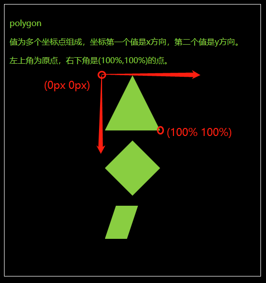
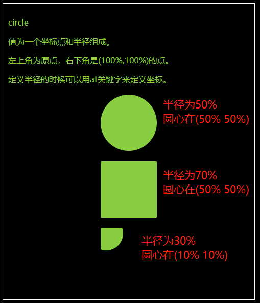
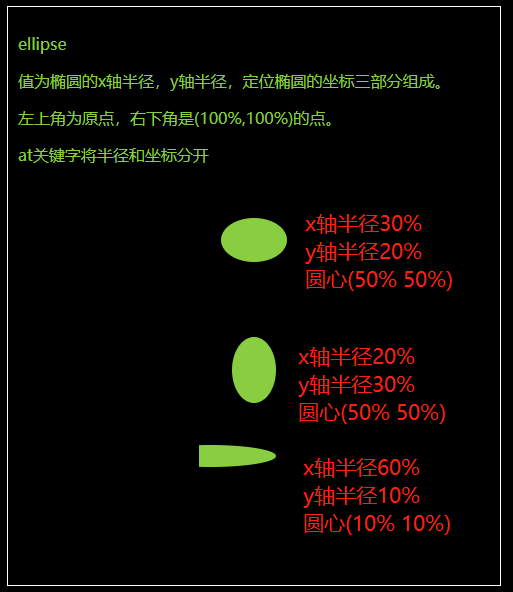
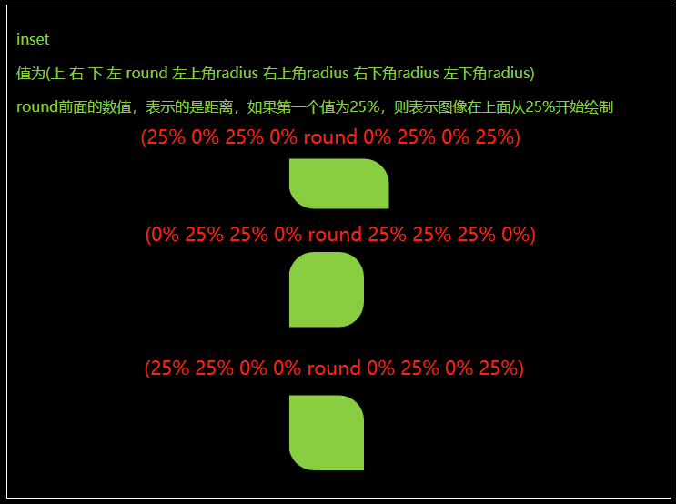

# clip-path的使用
## polygon
- 值为多个坐标点组成，坐标第一个值是x方向，第二个值是y方向。
- 左上角为原点，右下角是(100%,100%)的点。</p>
```css
body {
  background-color: #000;
}

.fa {
  border: 1px solid #fff;
  color: yellowgreen;
  padding: 10px;
  margin: 10px;
}

.fa>div {
  width: 110px;
  height: 110px;
  background-color: yellowgreen;
  margin: 20px auto;
}

.polygon1 {
  clip-path: polygon(50% 0px, 100% 100%, 0px 100%)
}

.polygon2 {
  clip-path: polygon(0px 50%, 50% 0, 100% 50%, 50% 100%)
}

.polygon3 {
  clip-path: polygon(0% 60%, 20% 0%, 60% 0%, 40% 60%)
}
```
```html
<div class="fa">
  <p>polygon</p>
  <p>值为多个坐标点组成，坐标第一个值是x方向，第二个值是y方向。</p>
  <p>左上角为原点，右下角是(100%,100%)的点。</p>
  <div class="polygon1"></div>
  <div class="polygon2"></div>
  <div class="polygon3"></div>
</div>
```
  
## circle
- 值为一个坐标点和半径组成。
- 左上角为原点，右下角是(100%,100%)的点。
- 定义半径的时候可以用at关键字来定义坐标。
```css
body {
  background-color: #000;
}

.fa {
  border: 1px solid #fff;
  color: yellowgreen;
  padding: 10px;
  margin: 10px;
}

.fa>div {
  width: 110px;
  height: 110px;
  background-color: yellowgreen;
  margin: 20px auto;
}

.circle1 {
  clip-path: circle(50% at 50% 50%)
}

.circle2 {
  clip-path: circle(70% at 50% 50%)
}

.circle3 {
  clip-path: circle(30% at 10% 10%)
}
```
```html
<div class="fa">
  <p>circle</p>
  <p>值为一个坐标点和半径组成。</p>
  <p>左上角为原点，右下角是(100%,100%)的点。</p>
  <p>定义半径的时候可以用at关键字来定义坐标。</p>
  <div class="circle1"></div>
  <div class="circle2"></div>
  <div class="circle3"></div>
</div>
```
  
## ellipse
- 值为椭圆的x轴半径，y轴半径，定位椭圆的坐标三部分组成。
- 左上角为原点，右下角是(100%,100%)的点。
- at关键字将半径和坐标分开。
```css
body {
  background-color: #000;
}

.fa {
  border: 1px solid #fff;
  color: yellowgreen;
  padding: 10px;
  margin: 10px;
}

.fa>div {
  width: 110px;
  height: 110px;
  background-color: yellowgreen;
  margin: 20px auto;
}

.ellipse1 {
  clip-path: ellipse(30% 20% at 50% 50%)
}

.ellipse2 {
  clip-path: ellipse(20% 30% at 50% 50%)
}

.ellipse3 {
  clip-path: ellipse(60% 10% at 10% 10%)
}
```
```html
<div class="fa">
  <p>ellipse</p>
  <p>值为椭圆的x轴半径，y轴半径，定位椭圆的坐标三部分组成。</p>
  <p>左上角为原点，右下角是(100%,100%)的点。</p>
  <p>at关键字将半径和坐标分开</p>
  <div class="ellipse1"></div>
  <div class="ellipse2"></div>
  <div class="ellipse3"></div>
</div>
```
  
## inset
- 值为(上 右 下 左 round 左上角radius 右上角radius 右下角radius 左下角radius)
- round前面的数值，表示的是距离，如果第一个值为25%，则表示图像在上面从25%开始绘制。
```css
body {
  background-color: #000;
}

.fa {
  border: 1px solid #fff;
  color: yellowgreen;
  padding: 10px;
  margin: 10px;
}

.fa>div {
  width: 110px;
  height: 110px;
  background-color: yellowgreen;
  margin: 20px auto;
}

.inset1 {
  clip-path: inset(25% 0% 25% 0% round 0% 25% 0% 25%)
}

.inset2 {
  clip-path: inset(0% 25% 25% 0% round 25% 25% 25% 0%)
}

.inset3 {
  clip-path: inset(25% 25% 0% 0% round 0% 25% 0% 25%)
}
```
```html
<div class="fa">
  <p>inset</p>
  <p>值为(上 右 下 左 round 左上角radius 右上角radius 右下角radius 左下角radius)</p>
  <p>round前面的数值，表示的是距离，如果第一个值为25%，则表示图像在上面从25%开始绘制</p>
  <div class="inset1"></div>
  <div class="inset2"></div>
  <div class="inset3"></div>
</div>
```
  

