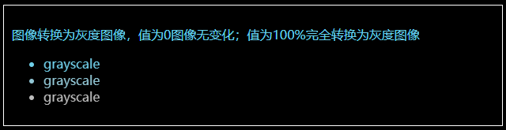

# filter 属性定义了元素的可视效果
## blur
- 给图像设置高斯模糊。"radius"一值设定高斯函数的标准差，或者是屏幕上以多少像素融在一起， 所以值越大越模糊。
- 如果没有设定值，则默认是0；这个参数可设置css长度值，但不接受百分比值。
  
```css
body {
  background-color: #000;
  color: skyblue;
}
div {
  border: 1px solid #fff;
  padding: 10px;
  width: 610px;
  margin: 10px;
}
.blur1 {
  filter: blur(0.4px);
}

.blur2 {
  filter: blur(1px);
}

.blur3 {
  filter: blur(4px);
}
```
```html
<div class="filter1">
  <p>给图像绘制高斯模糊，值越大越模糊</p>
  <ul>
    <li class="blur1">blur</li>
    <li class="blur2">blur</li>
    <li class="blur3">blur</li>
  </ul>
</div>
```
## brightness
- 给图片应用一种线性乘法，使其看起来更亮或更暗。如果值是0%，图像会全黑。值是100%，则图像无变化。其他的值对应线性乘数效果。值超过100%也是可以的，图像会比原来更亮。如果没有设定值，默认是1。
  
```css
body {
  background-color: #000;
  color: skyblue;
}
div {
  border: 1px solid #fff;
  padding: 10px;
  width: 610px;
  margin: 10px;
}
.brightness1 {
  filter: brightness(0.30);
}

.brightness2 {
  filter: brightness(0.8);
}

.brightness3 {
  filter: brightness(1);
}
```
```html
<div class="filter2">
  <p>给图像一种线性乘法使看起来更亮或者更暗。值为0图像全黑；值超过100%图像更亮</p>
  <ul>
    <li class="brightness1">brightness</li>
    <li class="brightness2">brightness</li>
    <li class="brightness3">brightness</li>
  </ul>
</div>
```
## contrast
- 调整图像的对比度。值是0%的话，图像会全黑。值是100%，图像不变。值可以超过100%，意味着会运用更低的对比。若没有设置值，默认是1。

  
```css
body {
  background-color: #000;
  color: skyblue;
}
div {
  border: 1px solid #fff;
  padding: 10px;
  width: 610px;
  margin: 10px;
}
.contrast1 {
  filter: contrast(10%);
}

.contrast2 {
  filter: contrast(50%);
}

.contrast3 {
  filter: contrast(100%);
}
```
```html
<div class="filter3">
  <p>调整图像对比度。值为0，图像全黑；值超过100%会运用更低的对比</p>
  <ul>
    <li class="contrast1">contrast</li>
    <li class="contrast2">contrast</li>
    <li class="contrast3">contrast</li>
  </ul>
</div>
```
## graycale
- 将图像转换为灰度图像。值定义转换的比例。值为100%则完全转为灰度图像，值为0%图像无变化。值在0%到100%之间，则是效果的线性乘子。若未设置，值默认是0；
  
```css
body {
  background-color: #000;
  color: skyblue;
}
div {
  border: 1px solid #fff;
  padding: 10px;
  width: 610px;
  margin: 10px;
}
.grayscale1 {
  filter: grayscale(10%);
}

.grayscale2 {
  filter: grayscale(50%);
}

.grayscale3 {
  filter: grayscale(100%);
}
```
```html
<div class="filter4">
  <p>图像转换为灰度图像，值为0图像无变化；值为100%完全转换为灰度图像</p>
  <ul>
    <li class="grayscale1">grayscale</li>
    <li class="grayscale2">grayscale</li>
    <li class="grayscale3">grayscale</li>
  </ul>
</div>
```
## hue-rotate
- 给图像应用色相旋转。"angle"一值设定图像会被调整的色环角度值。值为0deg，则图像无变化。若值未设置，默认值是0deg。该值虽然没有最大值，超过360deg的值相当于又绕一圈。
  
```css
body {
  background-color: #000;
  color: skyblue;
}
div {
  border: 1px solid #fff;
  padding: 10px;
  width: 610px;
  margin: 10px;
}
.huerotate1 {
  filter: hue-rotate(0deg);
}

.huerotate2 {
  filter: hue-rotate(90deg);
}

.huerotate3 {
  filter: hue-rotate(180deg);
}
```
```html
<div class="filter5">
  <p>给图像用色相旋转。值为0deg图像无变化；没有最大值，超过360deg相当于又绕一圈</p>
  <ul>
    <li class="huerotate1">huerotate</li>
    <li class="huerotate2">huerotate</li>
    <li class="huerotate3">huerotate</li>
  </ul>
</div>
```
## invert
- 反转输入图像。值定义转换的比例。100%的价值是完全反转。值为0%则图像无变化。值在0%和100%之间，则是效果的线性乘子。 若值未设置，值默认是0。
  
```css
body {
  background-color: #000;
  color: skyblue;
}
div {
  border: 1px solid #fff;
  padding: 10px;
  width: 610px;
  margin: 10px;
}
.invert1 {
  filter: invert(20%);
}

.invert2 {
  filter: invert(60%);
}

.invert3 {
  filter: invert(100%);
}
```
```html
<div class="filter6">
  <p>反转输入图像。0%图像无变化，100%图像完全反转</p>
  <ul>
    <li class="invert1">invert</li>
    <li class="invert2">invert</li>
    <li class="invert3">invert</li>
  </ul>
</div>
```
## opacity
- 转化图像的透明程度。值定义转换的比例。值为0%则是完全透明，值为100%则图像无变化。值在0%和100%之间，则是效果的线性乘子，也相当于图像样本乘以数量。 若值未设置，值默认是1。该函数与已有的opacity属性很相似，不同之处在于通过filter，一些浏览器为了提升性能会提供硬件加速。
  
```css
body {
  background-color: #000;
  color: skyblue;
}
div {
  border: 1px solid #fff;
  padding: 10px;
  width: 610px;
  margin: 10px;
}
.opacity1 {
  filter: opacity(10%);
}

.opacity2 {
  filter: opacity(80%);
}

.opacity3 {
  filter: opacity(100%);
}
```
```html
<div class="filter7">
  <p>转化图像的透明度。0%，完全透明；100%图像无变化</p>
  <ul>
    <li class="opacity1">opacity</li>
    <li class="opacity2">opacity</li>
    <li class="opacity3">opacity</li>
  </ul>
</div>
```
## saturate
- 转换图像饱和度。值定义转换的比例。值为0%则是完全不饱和，值为100%则图像无变化。其他值，则是效果的线性乘子。超过100%的值是允许的，则有更高的饱和度。 若值未设置，值默认是1。
  
```css
body {
  background-color: #000;
  color: skyblue;
}
div {
  border: 1px solid #fff;
  padding: 10px;
  width: 610px;
  margin: 10px;
}
.saturate1 {
  filter: saturate(0.2);
}

.saturate2 {
  filter: saturate(0.6);
}

.saturate3 {
  filter: saturate(1);
}
```
```html
<div class="filter8">
  <p>转换图像饱和度。0%完全不饱和；100%，完全饱和</p>
  <ul>
    <li class="saturate1">saturate</li>
    <li class="saturate2">saturate</li>
    <li class="saturate3">saturate</li>
  </ul>
</div>
```
## sepia
- 将图像转换为深褐色。值定义转换的比例。值为100%则完全是深褐色的，值为0%图像无变化。值在0%到100%之间，则是效果的线性乘子。若未设置，值默认是0；
  
```css
body {
  background-color: #000;
  color: skyblue;
}
div {
  border: 1px solid #fff;
  padding: 10px;
  width: 610px;
  margin: 10px;
}
.sepia1 {
  filter: sepia(10%);
}

.sepia2 {
  filter: sepia(60%);
}

.sepia3 {
  filter: sepia(100%);
}
```
```html
<div class="filter9">
  <p>图像转换为深褐色。值为100%为深褐色；值为0%图像无变化</p>
  <ul>
    <li class="sepia1">sepia</li>
    <li class="sepia2">sepia</li>
    <li class="sepia3">sepia</li>
  </ul>
</div>
```
## drop-shadow
- 给图像设置一个阴影效果。阴影是合成在图像下面，可以有模糊度的，可以以特定颜色画出的遮罩图的偏移版本。 函数接受<shadow>(在CSS3背景中定义)类型的值，除了"inset"关键字是不允许的。该函数与已有的box-shadow box-shadow属性很相似；不同之处在于，通过滤镜，一些浏览器为了更好的性能会提供硬件加速。
  
```css
body {
  background-color: #000;
  color: skyblue;
}
div {
  border: 1px solid #fff;
  padding: 10px;
  width: 610px;
  margin: 10px;
}
.shadow1 {
  filter: drop-shadow(2px 2px 2px red);
}

.shadow2 {
  filter: drop-shadow(8px 8px 1px purple);
}

.shadow3 {
  filter: drop-shadow(1px 1px 10px hotpink);
}
```
```html
<div class="filter10">
  <p>图像设置阴影效果</p>
  <ul>
    <li class="shadow1">shadow</li>
    <li class="shadow2">shadow</li>
    <li class="shadow3">shadow</li>
  </ul>
</div>
```
