# grid布局
## 加在父元素上的属性
### grid-template-columns/grid-template-rows
- 定义元素的行或列的宽高
- 如果父元素被等分成了9等分，则，不管有多少个子元素，都显示9等分
- grid-template-columns: 33% 33% 33%;可以写成grid-template-columns:repeat(3, 33%);
```css
.container {
  width: 200px;
  height: 200px;
  display: grid;
  background-color: coral;
  margin: 10px;
}

.container .item {
  border: 1px solid #ccc;
  background-color: chocolate;
}
.container1 {
  grid-template-columns: 33% 33% 33%;
  grid-template-rows: 33% 33% 33%;
}
```
```html
<div class="container container1">
  <div class="item item-1"></div>
  <div class="item item-2"></div>
</div>
```
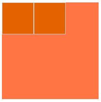
### grid-template-areas
- 父元素的grid-template-areas配合子元素的grid-area定义网格区域
- 一个句点表示一个空的网格单元
```css
.container {
  width: 200px;
  height: 200px;
  display: grid;
  background-color: coral;
  margin: 10px;
}

.container .item {
  border: 1px solid #ccc;
  background-color: chocolate;
}
.container2 {
  grid-template-columns: 1fr 1fr 1fr 1fr;
  grid-template-rows: 1fr 1fr 1fr;
  grid-template-areas: "header header . footer"
    "main main . sidebar"
    "main main . sidebar";
}

.container2 .item-1 {
  grid-area: header;
}

.container2 .item-2 {
  grid-area: main;
}

.container2 .item-3 {
  grid-area: sidebar;
}

.container2 .item-4 {
  grid-area: footer;
}
```
```html
<div class="container container2">
  <div class="item item-1">header</div>
  <div class="item item-2">main</div>
  <div class="item item-3">sidebar</div>
  <div class="item item-4">footer</div>
</div>
```
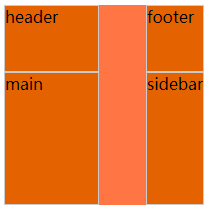
### grid-column-gap/grid-row-gap/grip-gap
- 指网格线的大小，也可以说是网格子项之间的间距
```css
.container {
  width: 200px;
  height: 200px;
  display: grid;
  background-color: coral;
  margin: 10px;
}

.container .item {
  border: 1px solid #ccc;
  background-color: chocolate;
}
.container3 {
  grid-template-columns: repeat(3, 30%);
  grid-template-rows: repeat(3, 30%);
  grid-column-gap: 2%;
  grid-row-gap: 2%;
}
```
```html
<div class="container container3">
  <div class="item item-1"></div>
  <div class="item item-2"></div>
  <div class="item item-3"></div>
  <div class="item item-4"></div>
  <div class="item item-5"></div>
  <div class="item item-6"></div>
  <div class="item item-7"></div>
  <div class="item item-8"></div>
  <div class="item item-9"></div>
</div>
```
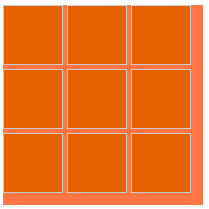
### justify-items/align-items
- justify-items让子元素的内容和纵向列轴对齐
- align-items让子元素的内容和横向行轴对齐
- 两个属性都有四个值
- 我的例子中，为了方便对比，嵌套了grid网格
```css
.container {
  width: 200px;
  height: 200px;
  display: grid;
  background-color: coral;
  margin: 10px;
}

.container .item {
  border: 1px solid #ccc;
  background-color: chocolate;
}

.container4 {
  width: 400px;
  height: 200px;
  grid-template-columns: repeat(4, 25%);
  grid-template-rows: repeat(2, 50%);
}
.container4 .item {
  display: grid;
}
.container4 .item div {
  background-color: coral;
  border: 1px dashed #aaa
}
.container4 .item-1 {
  grid-template-columns: repeat(2, 50%);
  grid-template-rows: repeat(2, 50%);
  justify-items: start;
}
.container4 .item-2 {
  grid-template-columns: repeat(2, 50%);
  grid-template-rows: repeat(2, 50%);
  justify-items: end;
}
.container4 .item-3 {
  grid-template-columns: repeat(2, 50%);
  grid-template-rows: repeat(2, 50%);
  justify-items: center;
}
.container4 .item-4 {
  grid-template-columns: repeat(2, 50%);
  grid-template-rows: repeat(2, 50%);
  justify-items: stretch;
}
.container4 .item-5 {
  grid-template-columns: repeat(2, 50%);
  grid-template-rows: repeat(2, 50%);
  align-items: start;
}
.container4 .item-6 {
  grid-template-columns: repeat(2, 50%);
  grid-template-rows: repeat(2, 50%);
  align-items: end;
}
.container4 .item-7 {
  grid-template-columns: repeat(2, 50%);
  grid-template-rows: repeat(2, 50%);
  align-items: center;
}
.container4 .item-8 {
  grid-template-columns: repeat(2, 50%);
  grid-template-rows: repeat(2, 50%);
  align-items: stretch;
}
```
```html
<div class="container container4">
  <div class="item item-1">
    <div>list</div>
    <div>list</div>
    <div>list</div>
    <div>list</div>
  </div>
  <div class="item item-2">
    <div>list</div>
    <div>list</div>
    <div>list</div>
    <div>list</div>
  </div>
  <div class="item item-3">
    <div>list</div>
    <div>list</div>
    <div>list</div>
    <div>list</div>
  </div>
  <div class="item item-4">
    <div>list</div>
    <div>list</div>
    <div>list</div>
    <div>list</div>
  </div>
  <div class="item item-5">
    <div>list</div>
    <div>list</div>
    <div>list</div>
    <div>list</div>
  </div>
  <div class="item item-6">
    <div>list</div>
    <div>list</div>
    <div>list</div>
    <div>list</div>
  </div>
  <div class="item item-7">
    <div>list</div>
    <div>list</div>
    <div>list</div>
    <div>list</div>
  </div>
  <div class="item item-8">
    <div>list</div>
    <div>list</div>
    <div>list</div>
    <div>list</div>
  </div>
```
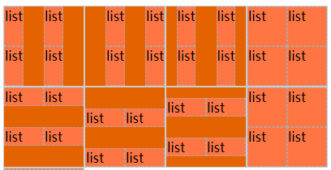
### justify-content/align-content
- 设置子元素的对齐方式，justify表示纵向，align表示横向
```css
.container {
  width: 200px;
  height: 200px;
  display: grid;
  background-color: coral;
  margin: 10px;
}

.container .item {
  border: 1px solid #ccc;
  background-color: chocolate;
}

.container5 {
  width: 700px;
  height: 200px;
  grid-template-columns: repeat(7, 14%);
  grid-template-rows: repeat(2, 50%);
}

.container5 .item {
  display: grid;
}

.container5 .item div {
  background-color: coral;
  border: 1px dashed #aaa
}

.container5 .item-1 {
  grid-template-columns: repeat(2, 40%);
  grid-template-rows: repeat(2, 40%);
  justify-content: start;
}

.container5 .item-2 {
  grid-template-columns: repeat(2, 40%);
  grid-template-rows: repeat(2, 40%);
  justify-content: end;
}

.container5 .item-3 {
  grid-template-columns: repeat(2, 40%);
  grid-template-rows: repeat(2, 40%);
  justify-content: center;
}

.container5 .item-4 {
  grid-template-columns: repeat(2, 40%);
  grid-template-rows: repeat(2, 40%);
  justify-content: stretch;
}

.container5 .item-5 {
  grid-template-columns: repeat(2, 40%);
  grid-template-rows: repeat(2, 40%);
  justify-content: space-around;
}

.container5 .item-6 {
  grid-template-columns: repeat(2, 40%);
  grid-template-rows: repeat(2, 40%);
  justify-content: space-between;
}

.container5 .item-7 {
  grid-template-columns: repeat(2, 40%);
  grid-template-rows: repeat(2, 40%);
  justify-content: space-evenly;
}

.container5 .item-8 {
  grid-template-columns: repeat(2, 40%);
  grid-template-rows: repeat(2, 40%);
  align-content: start;
}

.container5 .item-9 {
  grid-template-columns: repeat(2, 40%);
  grid-template-rows: repeat(2, 40%);
  align-content: end;
}

.container5 .item-10 {
  grid-template-columns: repeat(2, 40%);
  grid-template-rows: repeat(2, 40%);
  align-content: center;
}

.container5 .item-11 {
  grid-template-columns: repeat(2, 40%);
  grid-template-rows: repeat(2, 40%);
  align-content: stretch;
}

.container5 .item-12 {
  grid-template-columns: repeat(2, 40%);
  grid-template-rows: repeat(2, 40%);
  align-content: space-around;
}

.container5 .item-13 {
  grid-template-columns: repeat(2, 40%);
  grid-template-rows: repeat(2, 40%);
  align-content: space-between;
}

.container5 .item-14 {
  grid-template-columns: repeat(2, 40%);
  grid-template-rows: repeat(2, 40%);
  align-content: space-evenly;
}
```
```html
<div class="container container5">
  <div class="item item-1">
    <div>list</div>
    <div>list</div>
    <div>list</div>
    <div>list</div>
  </div>
  <div class="item item-2">
    <div>list</div>
    <div>list</div>
    <div>list</div>
    <div>list</div>
  </div>
  <div class="item item-3">
    <div>list</div>
    <div>list</div>
    <div>list</div>
    <div>list</div>
  </div>
  <div class="item item-4">
    <div>list</div>
    <div>list</div>
    <div>list</div>
    <div>list</div>
  </div>
  <div class="item item-5">
    <div>list</div>
    <div>list</div>
    <div>list</div>
    <div>list</div>
  </div>
  <div class="item item-6">
    <div>list</div>
    <div>list</div>
    <div>list</div>
    <div>list</div>
  </div>
  <div class="item item-7">
    <div>list</div>
    <div>list</div>
    <div>list</div>
    <div>list</div>
  </div>
  <div class="item item-8">
    <div>list</div>
    <div>list</div>
    <div>list</div>
    <div>list</div>
  </div>
  <div class="item item-9">
    <div>list</div>
    <div>list</div>
    <div>list</div>
    <div>list</div>
  </div>
  <div class="item item-10">
    <div>list</div>
    <div>list</div>
    <div>list</div>
    <div>list</div>
  </div>
  <div class="item item-11">
    <div>list</div>
    <div>list</div>
    <div>list</div>
    <div>list</div>
  </div>
  <div class="item item-12">
    <div>list</div>
    <div>list</div>
    <div>list</div>
    <div>list</div>
  </div>
  <div class="item item-13">
    <div>list</div>
    <div>list</div>
    <div>list</div>
    <div>list</div>
  </div>
  <div class="item item-14">
    <div>list</div>
    <div>list</div>
    <div>list</div>
    <div>list</div>
  </div>
</div>
```
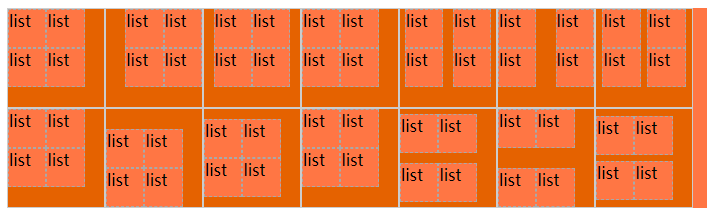
### grid-auto-columns/grid-auto-rows
- grid-column后面的值如果是1 / 2形式，表示的是从第1列网格线开始到第2列网格线结束，如果这个属性定义的网格超出了父元素的范围，则会自动生成隐式网格
- grid-auto-columns和grid-auto-rows两个属性来指定这些隐式网格轨迹的宽度
```css
.container {
  width: 200px;
  height: 200px;
  display: grid;
  background-color: coral;
  margin: 10px;
}

.container .item {
  border: 1px solid #ccc;
  background-color: chocolate;
}

.container6 {
  width: 120px;
  height: 180px;
  grid-template-columns: 60px 60px;
  grid-template-rows: 90px 90px;
  grid-auto-columns: 60px;
}
.container6 .item-1 {
  grid-column: 1 / 2;
  grid-row: 2 / 3;
  border: 1px solid #ccc;
}
.container6 .item-2 {
  grid-column: 5 / 6;
  grid-row: 2 / 3;
  border: 1px solid #ccc;
}
```
```html
<div class="container container6">
  <div class="item-1">1/2&2/3</div>
  <div class="item-2">5/6&2/3</div>
</div>
```
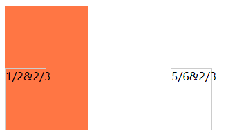
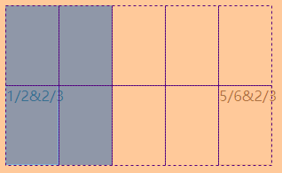
### grid-auto-flow
- 没有网格元素的时候，自动排列
- row表示从左到右排列，column表示从上到下排列
```css
.container {
  width: 200px;
  height: 200px;
  display: grid;
  background-color: coral;
  margin: 10px;
}

.container .item {
  border: 1px solid #ccc;
  background-color: chocolate;
}

.container7 {
  display: grid;
  width: 200px;
  height: 40px;
  grid-template-columns: 40px 40px 40px 40px 40px;
  grid-template-rows: 40px 40px;
  /* grid-auto-flow: row; */
  grid-auto-flow: column;
}
.container7 .item-1 {
  grid-column: 1;
  grid-row: 1 / 3;
}

.container7 .item-5 {
  grid-column: 5;
  grid-row: 1 / 3;
}
```
```html
<div class="container container7">
  <div class="item item-1">1</div>
  <div class="item item-2">2</div>
  <div class="item item-3">3</div>
  <div class="item item-4">4</div>
  <div class="item item-5">5</div>
</div>
```
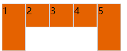
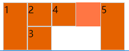
## 加在子元素上的属性
### grid-column-start/grid-column-end/grid-row-start/grid-row-end/grid-column/grid-row
- 定义网格开始或者结束的位置
- 值为数字，表示从这条线开始。值为span加数字，表示覆盖了这条线的位置
```css
.container {
  width: 200px;
  height: 200px;
  display: grid;
  background-color: coral;
  margin: 10px;
}

.container .item {
  border: 1px solid #ccc;
  background-color: chocolate;
}

.container8 {
  margin-top: 20px;
  grid-template-columns: repeat(5, 20%);
  grid-template-rows: repeat(5, 20%);
}
.container8 .item-1 {
  grid-column-start: 2;
  grid-column-end: 4;
  grid-row-start: 1;
  grid-row-end: 2;
}
.container8 .item-2 {
  grid-column-start: 4;
  grid-column-end: span 5;
  grid-row-start: 2;
  grid-row-end: span 5;
}
.container8 .item-3 {
  grid-column: 1 / span 2;
  grid-row: 2 / span 4;
}
```
```html
<div class="container container8">
  <div class="item item-1">item-1</div>
  <div class="item item-2">item-2</div>
  <div class="item item-3">item-3</div>
</div>
```
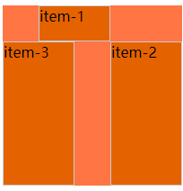
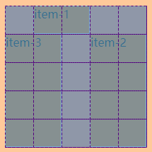

### justify-self/align-self
- 网格子项内容与格线对齐
```css
.container {
  width: 200px;
  height: 200px;
  display: grid;
  background-color: coral;
  margin: 10px;
}

.container .item {
  border: 1px solid #ccc;
  background-color: chocolate;
}
.container9 {
  width: 400px;
  height: 200px;
  grid-template-columns: repeat(4, 25%);
  grid-template-rows: repeat(2, 50%);
}
.container9 .item-1 {
  justify-self: start;
}
.container9 .item-2 {
  justify-self: end;
}
.container9 .item-3 {
  justify-self: center;
}
.container9 .item-4 {
  justify-self: stretch;
}
.container9 .item-5 {
  align-self: start;
}
.container9 .item-6 {
  align-self: end;
}
.container9 .item-7 {
  align-self: center;
}
.container9 .item-8 {
  align-self: stretch;
}
```

```html
<div class="container container9">
  <div class="item item-1">item-1</div>
  <div class="item item-2">item-2</div>
  <div class="item item-3">item-3</div>
  <div class="item item-4">item-4</div>
  <div class="item item-5">item-5</div>
  <div class="item item-6">item-6</div>
  <div class="item item-7">item-7</div>
  <div class="item item-8">item-8</div>
</div>
```
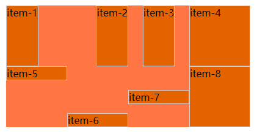
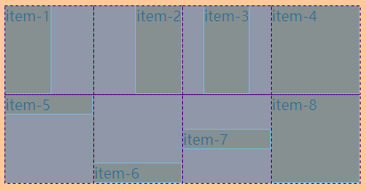
