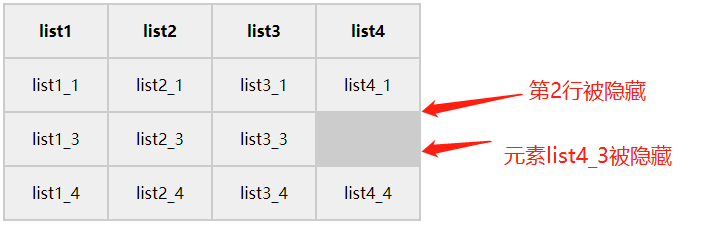
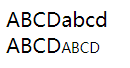

# CSS不熟练属性总结

## 布局clear
- 清除浮动带来的影响，可以用clear
- 值
  - none：允许两边都可以有浮动对象
  - both：不允许有浮动对象
  - left：不允许左边有浮动对象
  - right：不允许右边有浮动对象
```css
.father {
  width: 200px;
  height: 200px;
  position: relative;
  background-color: #ccc;
}

.son1 {
  width: 100px;
  height: 100px;
  background-color: #666;
  float: left;
}

.son2 {
  width: 100px;
  height: 100px;
  background-color: #333;
  /* 这里对第二个元素采用clear，清除了前一个元素左浮动的影响 */
  clear: both;
}
```
```html
<div class="father">
  <div class="son1">浮动</div>
  <div class="son2">清除浮动影响</div>
</div>
```

- 第一个元素左浮动，第二个元素设定clear属性，清除了浮动影响


- 第一个元素左浮动，第二个元素没有设定clear属性，受浮动影响，被隐藏到第一个元素下面


## 布局visibility
- 设置隐藏或显示元素
- 值为collapse时，可用来隐藏表格的行或列
```css
table {
  background-color: #ccc;

}

tr {
  height: 50px;
  line-height: 50px;
  background-color: #eee;
}

td {
  width: 100px;
  text-align: center;
}

.hidethis {
  visibility: collapse;
}
```
```html
<table>
  <thead>
    <tr>
      <th>list1</th>
      <th>list2</th>
      <th>list3</th>
      <th>list4</th>
    </tr>
  </thead>
  <tbody>
    <tr>
      <td>list1_1</td>
      <td>list2_1</td>
      <td>list3_1</td>
      <td>list4_1</td>
    </tr>
    <tr class="hidethis">
      <td>list1_2</td>
      <td>list2_2</td>
      <td>list3_2</td>
      <td>list4_2</td>
    </tr>
    <tr>
      <td>list1_3</td>
      <td>list2_3</td>
      <td>list3_3</td>
      <td class="hidethis">list4_3</td>
    </tr>
    <tr>
      <td>list1_4</td>
      <td>list2_4</td>
      <td>list3_4</td>
      <td>list4_4</td>
    </tr>
  </tbody>
</table>
```

- 原始的表格
  

- 添加visibility属性，隐藏某行和某元素
  

## 边框border-radius
- 提供两个参数，以"/"分隔，第一个元素表示水平半径，第二个元素表示垂直半径
- 每个元素有四个参数值，分别表示四个角的半径，值相同时可以省略
  - 只提供一个值，这个值全部用于四个角
  - 提供两个值，第一个值为上左、下右，第二个值是上右、下左
  - 提供三个值，第一个值为上左，第二个值是上右、下左，第三个值是下右
  - 提供四个值，四个值按照顺序分别表示上左、上右、下右、下左

## 边框border-source
- 背景图的来源，可以使用绝对地址，也可以使用渐变色
```css
.test {
  padding: 10px;
  margin: 10px;
  border: 40px solid #ccc;
}

.test1 {
  border-image-slice: 100;
  border-image-source: url("./bg.png")
}

.test2 {
  border-image-slice: 100;
  border-image-source: linear-gradient(skyblue, pink)
}
```

```html
<div class="test test1">使用背景图</div>
<div class="test test2">使用渐变色</div>
```


## 边框border-image-slice
- 边框背景图的分隔方式，四个值分别表示距离背景图上边、右边、下边、左边的距离
- 切割将背景图分成上下左右、四个顶角、中心。共九部分。
- 值可以用百分比表示，也可以用像素值表示。用像素值表示时，不加单位。
- 第五个值为fill，不写fill的时候，中间部分为空
```css
.test {
  padding: 10px;
  margin: 10px;
  border: 40px solid #ccc;
  border-image-source: url("./bg.png")
}

.test1 {
  border-image-slice: 10% 20% 30% 40%;
}

.test2 {
  border-image-slice: 22 24 26 28;
}
```

```html
<div class="test test1">中心部分</div>
<div class="test test2">中心部分</div>
```

- 用百分比表示时的切割详情
  
  

## 边框border-image-outset
- padding和border之间空隙
  

## 边框border-image-repeat
- 两个参数，表示水平方向方式和垂直方向方式，水平方向和垂直方向值相同时合并为一个
  - stretch，拉伸填充
  - repeat，平铺填充，超过部分截断
  - round，平铺填充，根据尺寸调整图片大小
  - space，平铺填充，根据尺寸调整图片之间的间距
```css
.test {
  padding: 10px;
  margin: 20px;
  border: 40px solid #ccc;
  border-image-source: url("./bg.png");
  border-image-slice: 33% 33% 33% 33%;
}

.test1 {
  border-image-repeat: stretch;
}
.test2 {
  border-image-repeat: repeat;
}
.test3 {
  border-image-repeat: round;
}
.test4 {
  border-image-repeat: space;
}
```

```html
<div class="test test1">stretch，拉伸填充</div>
<div class="test test2">repeat，超过部分截断</div>
<div class="test test3">round，调整图片大小</div>
<div class="test test4">space，调整图片间距</div>
```


## 背景background-origin
- 设置背景图像开始的位置
  - padding-box，从padding区域开始显示图像
  - border-box，从border区域开始显示图像
  - content-box，从content区域开始显示图像
```css
.test {
  background-image: url("./bg.png");
  margin: 10px;
  padding: 10px;
  color: #fff;
  font-size: 20px;
  border: 10px solid #ccc;
}
.test1 {
  background-origin: border-box;
}
.test2 {
  background-origin: padding-box;
}
.test3 {
  background-origin: content-box;
}
```

```html
<div class="test test1">border-box</div>
<div class="test test2">padding-box</div>
<div class="test test3">content-box</div>
```


## 背景background-clip
- 设置背景图像截取的位置
  - padding-box，从padding区域开始截取图像
  - border-box，从border区域开始截取图像
  - content-box，从content区域开始截取图像
  - text，根据前景内容截取图像
```css
.test {
  background-image: url("./bg.png");
  margin: 10px;
  padding: 10px;
  color: #fff;
  font-size: 20px;
  border: 10px dashed #ccc;
}

.test1 {
  background-clip: border-box;
}

.test2 {
  background-clip: padding-box;
}

.test3 {
  background-clip: content-box;
}

.test4 {
  -webkit-background-clip: text;
  -webkit-text-fill-color: transparent;
  font-weight: bold;
  font-size: 120px;
}
```

```html
<div class="test test1">border-box</div>
<div class="test test2">padding-box</div>
<div class="test test3">content-box</div>
<div class="test test4">text</div>
```


## 字体font-variant
- 将字体转换为小型大写字母
```css
.test {
  font-size: 20px;
}
.test2 span {
  font-variant: small-caps;
}
```

```html
<div class="test test1">ABCD<span>abcd</span></div>
<div class="test test2">ABCD<span>abcd</span></div>
```



## 文本text-transform
- 将单词第一个字母转换成大写
- 将每个单词转换成大写
- 将每个单词转换成小写

```css
.test {
  font-size: 20px;
}
.test2 {
  text-transform: capitalize;
}
.test3 {
  text-transform: uppercase;
}
.test4 {
  text-transform: lowercase;
}
```

```html
<div class="test test1">aBcDeFg</div>
<div class="test test2">aBcDeFg</div>
<div class="test test3">aBcDeFg</div>
<div class="test test4">aBcDeFg</div>
```


## 文本white-space
- pre，格式化文本，不合并多余的空白距离，不换行
- nowrap，强制一行内显示文本，合并多余的空白文本，不换行
- pre-wrap，格式化文本，不合并多余的空白距离，换行
- pre-line，保持换行，合并多余的空白距离，换行
```css
.test {
  font-size: 20px;
  width: 200px;
  border: 1px solid #ccc;
  margin: 10px;
  padding: 10px;
}
.test1 {
  white-space: normal;
}
.test2 {
  white-space: pre;
}
.test3 {
  white-space: nowrap;
}
.test4 {
  white-space: pre-wrap;
}
.test5 {
  white-space: pre-line;
}
```

```html
<div class="test test1">默认默认默认默认默认默认默认</div>
<div class="test test2">pre 格式化文本 不合并     空白距离 不换行</div>
<div class="test test3">nowrap 强制一行内显示文本 合并多余     空白距离 不换行</div>
<div class="test test4">pre-wrap 格式化文本 不合并     空白距离 换行</div>
<div class="test test5">pre-line 保持换行  
  合并多余     空白距离  
  换行</div>
```


## 文本overflow-wrap/word-wrap
- 值为break-word表示内容将在边界内换行
- 中英混排时，不加此属性也会自动换行

```css
.test {
  width: 80px;
  background-color: #ccc;
  margin: 10px;
  padding: 10px;

}
.test1 {
  word-wrap: normal;
}
.test2 {
  word-wrap: break-word;
}
.test3 {
  /* word-wrap: break-word; */
}
.test4 {
  word-wrap: break-word;
}
```
```html
<div class="test test1">aaaaaaaaaaaa</div>
<div class="test test2">aaaaaaaaaaaa</div>
<div class="test test3">不加属性aaaaaaaaaaaa</div>
<div class="test test4">添加属性aaaaaaaaaaaa</div>
```


## 书写模式direction&书写模式unicode-bidi
- direction:ltr文本流从左到右
- direction:rtl文本流从右到左
- unicode-bidi:bidi-override;逆向读
- unicode-bidi:bidi-override;正向读
```css
.test {
  background-color: #ccc;
  margin: 10px;
  padding: 10px;
}
.test1 {
  direction: ltr;
}
.test2 {
  direction: rtl;
}
.test3 {
  direction: ltr;
  unicode-bidi:bidi-override;
}
.test4 {
  direction: rtl;
  unicode-bidi:bidi-override;
}
.test5 {
  direction: rtl;
  unicode-bidi:embed;
}
```

```html
<div class="test test1">添加ltr属性的文字</div>
<div class="test test2">添加rtl属性的文字</div>
<div class="test test3">添加ltr，bidi-override属性的文字</div>
<div class="test test4">添加rtl，bidi-override属性的文字</div>
<div class="test test5">添加rtl，embed属性的文字</div>
```


## 书写模式writin-mode
- horizontal-tb，水平方向自上而下
- vertical-rl，垂直方向自右而左
- vertical-lr，垂直方向自左而右
- lr-tb，左右上下，水平方向从左向右流入，后一行在前一行的下面，字形竖直向上
- tb-rl，上下右左，垂直方向从上向下流入，自右向左，全角字符竖直向上，半角字符或拉丁字母或片假名顺时针旋转90度
```css
.test {
  background-color: #ccc;
  margin: 10px;
  padding: 10px;
  width: 250px;
  height: 80px;
}
.test1 {
  writing-mode: horizontal-tb;
}
.test2 {
  writing-mode: vertical-rl;
}
.test3 {
  writing-mode: vertical-lr;
}
.test4 {
  writing-mode: lr-tb;
}
.test5 {
  writing-mode: tb-rl;
}
```

```html
<div class="test test1">horizontal-tb:左右上下，水平方向自上而下</div>
<div class="test test2">vertical-rl:上下右左，垂直方向自右而左</div>
<div class="test test3">vertical-lr:上下左右，垂直方向自左而右</div>
<div class="test test4">lr-tb:左右上下，水平方向从左向右流入，后一行在前一行的下面，字形竖直向上</div>
<div class="test test5">tb-rl:上下右左，垂直方向从上向下流入，自右向左，全角字符竖直向上，半角字符或拉丁字母或片假名顺时针旋转90度</div>
```


## 列表list-style-position
- outside，列表项目标记放在文本之外
- inside，列表项目标记放在文本之内

## 列表list-style-type
- disc：实心圆
- circle：空心圆
- square：实心方块
- decimal：阿拉伯数字
- lower-roman：小写罗马数字
- upper-roman：大写罗马数字
- lower-alpha：小写英文字母
- upper-alpha：大写英文字母
- none：不使用项目符号
- armenian：传统的亚美尼亚数字
- cjk-ideographic：浅白的表意数字
- georgian：传统的乔治数字
- lower-greek：基本的希腊小写字母
- hebrew：传统的希伯莱数字
- hiragana：日文平假名字符
- hiragana-iroha：日文平假名序号
- katakana：日文片假名字符
- katakana-iroha：日文片假名序号
- lower-latin：小写拉丁字母
- upper-latin：大写拉丁字母
  
  

## 表格table-layout
- 表格元素宽度，给定table宽度，值为auto时，根据元素内容，分配宽度。值为fixed时，平均分配宽度
```css
table {
  background-color: #ccc;
  width: 400px;
  /* table-layout: fixed; */
}

tr {
  height: 50px;
  line-height: 50px;
  background-color: #eee;
}

td {

  text-align: center;
}
```

```html
<table>
  <thead>
    <tr>
      <th>list1list1list1</th>
      <th>list2</th>
      <th>list3list3</th>
      <th>list4</th>
    </tr>
  </thead>
  <tbody>
    <tr>
      <td>list1_1</td>
      <td>list2_1</td>
      <td>list3_1</td>
      <td>list4_1</td>
    </tr>
  </tbody>
</table>
```

- 没有table-layout属性
  

- 存在table-layout属性，值为fixed
  

## 表格border-collapse&表格border-spacing
- border-collpase:separate;边框独立
- border-collpase:collapse;相邻边框被合并
- border-spacing用数值表示边框距离左右、上下的长度
```css
table {
  background-color: #ccc;
  width: 400px;
  border-collapse: separate;
  /* border-collapse: collapse; */
  border-spacing: 10px 20px;
}

tr {
  height: 50px;
  line-height: 50px;
  background-color: #eee;
}

td {      
  text-align: center;
}
```

```html
<table>
  <thead>
    <tr>
      <th>list1list1list1</th>
      <th>list2</th>
      <th>list3list3</th>
      <th>list4</th>
    </tr>
  </thead>
  <tbody>
    <tr>
      <td>list1_1</td>
      <td>list2_1</td>
      <td>list3_1</td>
      <td>list4_1</td>
    </tr>
  </tbody>
</table>
```

- border-collapse属性的值为separate
  

- border-collapse属性的值为collapse
  

## 表格caption-side
- 表格caption的位置，top在表格上方，bottom在表格下方

## 表格empty-cells
- 指定单元格没有内容时，可以显示或隐藏当前单元格


```css
table {
  background-color: #ccc;
  width: 400px;
}

tr {
  height: 50px;
  line-height: 50px;
  background-color: #eee;
}

td {      
  text-align: center;
}
.show {
  empty-cells: show;
}
.hide {
  empty-cells: hide;
}
```

```html
<table>
  <thead>
    <tr>
      <th>list1list1list1</th>
      <th>list2</th>
      <th>list3list3</th>
      <th>list4</th>
    </tr>
  </thead>
  <tbody>
    <tr>
      <td>list1_1</td>
      <td class="show"></td>
      <td>list3_1</td>
      <td class="hide"></td>
    </tr>
  </tbody>
</table>
```
  

## 内容content
- content多用于伪元素
- content:"是"; content值为字符串时，显示字符串内容
- content:attr(title); content值为attr时，显示元素attr属性的内容
- content:url("./img.png"); content值为图片时，显示图片的内容
- content:counter(name);content值为counter时，使用已命名的计数器

## 内容content-increment
- 定义当一个selector发生时，每次增加的值
- 此属性用于实际的元素
```css
.test ol {
  margin: 16px 0;
  padding: 0;
  list-style: none;
}

.test li li:before {
  color: #f00;
  font-family: georgia, serif, sans-serif;
}

.counter1 li {
  counter-increment: testname;
}

.counter1 li:before {
  content: counter(testname)".";
}

.counter2 li {
  counter-increment: testname2 2;
}

.counter2 li:before {
  content: counter(testname2)".";
}

.counter3 li {
  counter-increment: testname3 -1;
}

.counter3 li:before {
  content: counter(testname3)".";
}
```

```html
<ul class="test">
  <li class="counter1">
    <strong>默认时的计数器：</strong>
    <ol>
      <li>列表项</li>
      <li>列表项</li>
      <li>列表项</li>
    </ol>
  </li>
  <li class="counter2">
    <strong>修改计数器每次增加的值为2：</strong>
    <ol>
      <li>列表项</li>
      <li>列表项</li>
      <li>列表项</li>
    </ol>
  </li>
  <li class="counter3">
    <strong>修改计数器每次增加的值为-1：</strong>
    <ol>
      <li>列表项</li>
      <li>列表项</li>
      <li>列表项</li>
    </ol>
  </li>
</ul>
```
  

## 内容content-increment
- 指定selector的计数器复位
- 此属性用于实际的元素
```css
.test ol {
  margin: 16px 0;
  padding: 0;
  list-style: none;
}

.test li li:before {
  color: #f00;
  font-family: georgia, serif, sans-serif;
}

.counter1 li {
  counter-increment: testname;
}

.counter1 li:before {
  content: counter(testname)".";
  counter-reset: testname;
}

.counter2 li {
  counter-increment: testname2;
}

.counter2 li:before {
  content: counter(testname2)".";
  counter-reset: testname2 20;
}

.counter3 li {
  counter-increment: testname3;
}

.counter3 li:before {
  content: counter(testname3)".";
  counter-reset: testname3 -1;
}
```

```html
<ul class="test">
  <li class="counter1">
    <strong>默认时被复位的计数器：</strong>
    <ol>
      <li>列表项</li>
      <li>列表项</li>
      <li>列表项</li>
    </ol>
  </li>
  <li class="counter2">
    <strong>将计算器复位为20：</strong>
    <ol>
      <li>列表项</li>
      <li>列表项</li>
      <li>列表项</li>
    </ol>
  </li>
  <li class="counter3">
    <strong>将计算器复位为-1：</strong>
    <ol>
      <li>列表项</li>
      <li>列表项</li>
      <li>列表项</li>
    </ol>
  </li>
</ul>
```
  

## 用户界面text-overflow
- 值为clip时，内容溢出容器，切除
- 值为ellipsis时，内容溢出容器，显示省略号

## 用户界面outline
- 设置元素外的线条轮廓，可设置宽度，样式，颜色三种属性

## 多列
- columus
  - column-width，设置或检索对象每列的宽度
  - column-count，设置或检索对象的列数
- column-gap，用长度值定义列与列之间的间隙
- column-rule
  - column-rule-width，设置或检索对象的列与列之间的边框厚度
    - medium，定义默认厚度的边框
    - thin，定义比默认厚度细的边框
    - thick，定义比默认厚度粗的边框
  - column-rule-style，设置或检索对象的列与列之间的边框样式
    - none，无轮廓
    - hidden，隐藏边框
    - dotted，点状轮廓
    - dashed，虚线轮廓
    - solid，实线轮廓
    - double，双线轮廓
    - groove，3D凹槽轮廓
    - ridge，3D凸槽轮廓
    - inset，3D凹边轮廓
    - outset，3D凸边轮廓
  - column-rule-color，设置或检索对象的列与列之间的边框颜色
  - column-rule-span，设置或检索对象是否横跨所有列
    - none，不跨列
    - all，横跨所有列
  - column-fill，设置或检索对象所有列的高度是否统一
    - auto，列高度自适应内容
    - balance，所有列的高度以其中最高的一列统一
  - column-break-before，设置或检索对象之前是否断行
    - auto，既不强迫也不禁止在元素之前断行并产生新列
    - always，总是在元素之前断行并产生新列
    - avoid，避免在元素之前断行并产生新列
  - column-break-after，设置或检索对象之后是否断行
    - auto，既不强迫也不禁止在元素之后断行并产生新列
    - always，总是在元素之后断行并产生新列
    - avoid，避免在元素之后断行并产生新列
  - column-break-inside，设置或检索对象内部是否断行
    - auto，既不强迫也不禁止在元素内部断行并产生新列
    - avoid，避免在元素内部断行并产生新列

## 伸缩盒flex-grow
- 设置弹性盒的扩展比率
- 默认值为0，不设置该属性的元素不分配空间

```css
.flex {
  display: flex;
  width: 600px;
  margin: 0;
  padding: 0;
  list-style: none;
  height:50px;
}

.flex :nth-child(1) {
  width: 200px;
  background-color: #ccc;
}

.flex :nth-child(2) {
  width: 50px;
  background-color: #bbb;
  flex-grow: 1;
}

.flex :nth-child(3) {
  width: 50px;
  background-color: #aaa;
  flex-grow: 3;
}
```

```html
<ul class="flex">
  <li>a</li>
  <li>b</li>
  <li>c</li>
</ul>
```

- 总宽度为600，三个子元素宽度分别为200、50、50，则剩余空间为600-200-50-50=300
- 第一个子元素没有flex-grow属性，不分配剩余空间，宽度不变，仍为200
- 第二个子元素分配剩余空间的1/4，即50+1/4\*300=125
- 第三个子元素分配剩余空间的3/4，即50+3/4\*300=275
  

## 伸缩盒flex-shrink
- 设置弹性盒的收缩比率
- 默认值为1，如果没有该属性，按照默认收缩1

```css
.flex {
  display: flex;
  width: 400px;
  margin: 0;
  padding: 0;
  list-style: none;
  height: 50px;
}

.flex li {
  width: 200px;

}
.flex :nth-child(1) {
  background-color: #ccc;
}
.flex :nth-child(2) {
  background-color: #bbb;
}
.flex :nth-child(3) {
  flex-shrink: 3;
  background-color: #aaa;
}
```

```html
<ul class="flex">
  <li>a</li>
  <li>b</li>
  <li>c</li>
</ul>
```

- 第一个元素和第二个元素没有显式定义，默认值按1计算，总共将空间分成5份
- 三个元素收缩的比例为1:1:3
- 三个元素总宽度为200+200+200=600，比ul宽度多出200
- 即收缩比例在多出的200上实现
- 三个元素分别收缩40:40:120
- 则三个元素收缩后的宽度为200-40:200-40:200-120=160:160:80
  
## 伸缩盒flex-basis
- 设置伸缩盒的伸缩基准值
- width属性和flex-basis属性都存在时，width属性不起作用
- flex-basis属性的值为auto时，恢复width属性作用
- 子元素宽度超过父元素宽度时，flex-basis用法与flex-shrink用法一致。反之和flex-grow一致

## 伸缩盒flex-flow
- flex-flow定义弹性盒子对象的子元素的排列方向
  - flex-direction定义弹性盒子元素的排列方向
    - row，主轴与行内轴方向作为默认的书写模式，横向从左到右排列
    - row-reverse，对齐方式与row相反
    - column，主轴与块轴作为默认的书写模式，纵向从上往下排列
    - column-reverse，对齐方式与column相反
  - flex-wrap控制flex容器是单行或者多行
    - nowrap，flex容器为单行，flex子项可能会溢出容器
    - wrap，flex容器为多行，flex子项溢出部分被放到新行，子项内部会发生断行
    - wrap-reverse，反转wrap排列

```css
.test {
  margin-top: 60px;
  margin-left: 10px;
  width: 100px;
  height: 100px;
  background-color: #ccc;          
  display: flex;
  float: left;
}
.test div {
  background-color: #eee;
  text-align: center;
  width: 50px;
  height: 50px;
  border: 1px solid #333;
}
.test1 {
  flex-direction: row;
}
.test2 {
  flex-direction: row-reverse;
}
.test3 {
  flex-direction: column;
}
.test4 {
  flex-direction: column-reverse;
}
.test5 {
  flex-wrap: nowrap;
}
.test6 {
  flex-wrap: wrap;
}
.test7 {
  flex-wrap: wrap-reverse;
}
```

```html
<div class="test test1">
  <div>a</div>
  <div>b</div>
  <div>c</div>
</div>
<div class="test test2">
  <div>a</div>
  <div>b</div>
  <div>c</div>
</div>
<div class="test test3">
  <div>a</div>
  <div>b</div>
  <div>c</div>
</div>

<div class="test test4">
  <div>a</div>
  <div>b</div>
  <div>c</div>
</div>


<div class="test test5">
  <div>a</div>
  <div>b</div>
  <div>c</div>
</div>
<div class="test test6">
  <div>a</div>
  <div>b</div>
  <div>c</div>
</div>
<div class="test test7">
  <div>a</div>
  <div>b</div>
  <div>c</div>
</div>
```


## 伸缩盒align-content
- flex-start，各行向弹性容器的起始位置堆叠，弹性盒容器中第一行的侧轴起始边界紧靠住该弹性盒容器的侧轴起始边界，之后的每一行都紧靠住前面一行
- flex-end，各行向弹性容器的结束位置堆叠，弹性盒容器中最后一行的侧轴结束边界紧靠住该弹性盒容器的侧轴结束边界，之后的每一行都紧靠住后面一行
- center，各行向弹性盒的中间位置堆叠，各行两两紧靠住同时在弹性盒容器中居中对齐，保持弹性盒容器的侧轴起始内容边界和第一行之间的距离与该容器的侧轴结束内容边界与最后一行之间的距离相等
- space-between，各行在弹性盒容器中均匀分布。如果剩余空间为负数或者弹性盒容器中只有一行，该值等效flex-start。第一行的侧轴起始边界紧靠弹性盒容器的侧轴起始边界，最后一行的侧轴结束边界紧靠弹性盒容器侧轴结合边界，剩余行按一定方式在弹性盒中排列，保持两两之间的空间相等
- space-around，各行在弹性盒容器中平均分布，两端保留子元素与子元素之间间距大小的一半，如果剩余空间为负或者弹性盒容器中只有一行，该值等效center
- stretch，各行伸展以占用剩余空间

```css
.test {
  margin: 10px;
  width: 200px;
  height: 200px;
  background-color: #ccc;
  display: flex;
  float: left;
  flex-wrap: wrap;
}

.test div {
  background-color: #eee;
  text-align: center;
  width: 50px;
  height: 50px;
  border: 1px solid #333;
  margin: 5px;
}

.test1 {
  align-content: flex-start;
}

.test2 {
  align-content: flex-end;
}

.test3 {
  align-content: center;
}

.test4 {
  align-content: space-between;
}

.test5 {
  align-content: space-around;
}

.test6 {
  align-content: stretch;
}
```

```html
<div class="test test1">
  <div>a</div>
  <div>b</div>
  <div>c</div>
  <div>d</div>
</div>
<div class="test test2">
  <div>a</div>
  <div>b</div>
  <div>c</div>
  <div>d</div>
</div>
<div class="test test3">
  <div>a</div>
  <div>b</div>
  <div>c</div>
  <div>d</div>
</div>

<div class="test test4">
  <div>a</div>
  <div>b</div>
  <div>c</div>
  <div>d</div>
</div>
<div class="test test5">
  <div>a</div>
  <div>b</div>
  <div>c</div>
  <div>d</div>
</div>
<div class="test test6">
  <div>a</div>
  <div>b</div>
  <div>c</div>
  <div>d</div>
</div>
```


## 伸缩盒align-items&伸缩盒align-self
- items设置所有子元素属性，self设置某个子元素属性
- flex-start，弹性盒子元素的侧轴起始边界紧靠住该行的侧轴起始边界
- flex-end，弹性盒子元素的侧轴结束边界紧靠住该行的侧轴结束边界
- center，弹性盒子元素在该行的侧轴上居中放置
- baseline，与基线对齐
- stretch，接近所在行的尺寸
```css
.test {
  margin: 10px;
  width: 200px;
  height: 200px;
  background-color: #ccc;
  display: flex;
  float: left;
  flex-wrap: wrap;
}

.test div {
  background-color: #eee;
  text-align: center;
  width: 30px;
  border: 1px solid #333;
  margin: 5px;
}

.test1 {
  align-items: flex-start;
}

.test2 {
  align-items: flex-end;
}

.test3 {
  align-items: center;
}

.test4 {
  align-items: baseline;
}

.test5 {
  align-items: stretch;
}

.test :nth-child(1) {
  padding: 10px;
}

.test :nth-child(2) {
  padding: 15px 10px;
}

.test :nth-child(3) {
  padding: 20px 10px;
}
```

```html
<div class="test test1">
  <div>a</div>
  <div>b</div>
  <div>c</div>
</div>
<div class="test test2">
  <div>a</div>
  <div>b</div>
  <div>c</div>
</div>
<div class="test test3">
  <div>a</div>
  <div>b</div>
  <div>c</div>
</div>

<div class="test test4">
  <div>a</div>
  <div>b</div>
  <div>c</div>
</div>
<div class="test test5">
  <div>a</div>
  <div>b</div>
  <div>c</div>
</div>
```


## 伸缩盒justify-content
- 五个值，flex-start、flex-end、center、space-between、space-around

```css
.test {
  margin: 10px;
  width: 200px;
  height: 100px;
  background-color: #ccc;
  display: flex;
  float: left;
  flex-wrap: wrap;
}

.test div {
  background-color: #eee;
  text-align: center;
  width: 20px;
  height: 50px;
  border: 1px solid #333;
  margin: 5px;
}

.test1 {
  justify-content: flex-start;
}

.test2 {
  justify-content: flex-end;
}

.test3 {
  justify-content: center;
}

.test4 {
  justify-content: space-between;
}

.test5 {
  justify-content: space-around;
}
```

```html
<div class="test test1">
  <div>a</div>
  <div>b</div>
  <div>c</div>
</div>
<div class="test test2">
  <div>a</div>
  <div>b</div>
  <div>c</div>
</div>
<div class="test test3">
  <div>a</div>
  <div>b</div>
  <div>c</div>
</div>

<div class="test test4">
  <div>a</div>
  <div>b</div>
  <div>c</div>
</div>
<div class="test test5">
  <div>a</div>
  <div>b</div>
  <div>c</div>
</div>
```

## 伸缩盒order
- 排序，有order属性的值，按大小顺序排列
- 没有order属性的元素默认排列到0的位置

```css
.test {
  margin: 10px;
  background-color: #ccc;
  display: flex;
  float: left;
}

.test div {
  background-color: #eee;
  text-align: center;
  width: 100px;
  height: 50px;
  border: 1px solid #333;
  margin: 5px;
}

.test :nth-child(1) {
  order: 1
}
.test :nth-child(3) {
  order: 76
}

.test :nth-child(4) {
  order: 19
}

.test :nth-child(5) {
  order: 8
}

.test :nth-child(6) {
  order: -1
}
```

```html
<div class="test">
  <div>a order:1</div>
  <div>none</div>
  <div>c order:76</div>
  <div>d order:19</div>
  <div>e order:8</div>
  <div>f order:-1</div>
</div>
```


## 媒体查询
- width

```css
/* 元素宽度在500px到1200px之间时 */
@media all and (min-width:500px) and (max-width:1200px) {
  body {color: #ccc;}
}
```

- height

```css
/* 元素高度在300px到500px之间时 */
@media all and (min-height:300px) and (max-height:500px) {
  body {color: #ccc;}
}
```

- device-width

```css
/* 屏幕横向分辨率为1024px时 */
@media screen and (device-width:1024px){
  body{color:#ccc;}
}
```

- device-height

```css
/* 屏幕纵向分辨率为800px时 */
@media screen and (device-height:800px){
  body{color:#ccc;}
}
```

- orientation

```css
/* 可见区域宽度是否大于高度 */
@media screen and (orientation: portrait){
  .test::after {
    content: "竖屏";
  }
}
@media screen and (orientation: landscape){
  .test::after {
    content: "横屏";
  }
}
```

- aspect-ratio

```css
/* 可见区域宽度高度比小于等于20:11时 */
@media screen and (max-aspect-ratio:20/11){
  body{color:#ccc;}
}
```

- device-aspect-ratio

```css
/* 输出设备屏幕分辨率为20:11时 */
@media screen and (device-aspect-ratio:16/10){
  body{color:#ccc;}
}
```

- color&color-index

```css
/*输出设备屏幕是彩色的*/
@media screen and (color){
  body{color:#ccc;}
}
/*输出设备屏幕使用了彩色查询时*/
@media screen and (min-color-index:0){
  body{color:#ccc;}
}
```

- monochrome

```css
/* 是否是单色设备 */
@media screen and (max-monochrome: 0){
  .test::after {
    content: "彩色";
  }
}
@media screen and (min-monochrome: 1){
  .test::after {
    content: "单色的（黑白色）";
  }
}
```

- resolution

```css
/*当你的输出设备分辨率大于或等于96dpi时*/
@media screen and (min-resolution:96dpi){
  body{color:#ccc;}
}
```

- scan

```css
当设备的扫描工序为progressive时
@media tv and (scan:progressive){
  body{color:#ccc;}
}
```

- grid

```css
当输出设备未使用栅格或点阵时
@media screen and (grid:0){
  body{color:#ccc;}
}
```