# CSS单位总结
- 公共部分css
```css
body {
  background-color: #000;
  color: skyblue;
  margin: 0;
  padding: 0;
}

body>div>div {
  border: 1px solid cyan;
  padding: 10px;
  margin: 10px;
  font-weight: bolder;
}

.s {
  background-color: #ddd;
  margin: 10px;
  white-space: nowrap;
  color: yellowgreen;
}
```
## 长度
### px
- 像素，同一屏幕分辨率下是绝对单位。屏幕分辨率不同时，像素等比缩放。
```css
/* list1 */
#length .list1s1 {
  width: 100px;
  height: 100px;
}

#length .list1s2 {
  width: 50px;
  height: 50px;
}
```
```html
<div class="list1">
  <p>px</p>
  <p>像素，同一屏幕分辨率下是绝对单位。屏幕分辨率不同时，像素等比缩放。</p>
  <div class="list1s1 s">100px X 100px</div>
  <div class="list1s2 s">50px X 50px</div>
</div>
```

### em
- 相对单位，相对于父元素的字体大小
- 如果父元素font-size是20px，那么2em就是40px
- em可精确到小数点后3位
```css
/* list2 */
#length .list2fa1 {
  font-size: 18px;
}

#length .list2fa2 {
  font-size: 22px;
}

#length .list2s1 {
  width: 5em;
  height: 5em;
}

#length .list2s2 {
  width: 5em;
  height: 5em;
}
```
```html
<div class="list2">
  <p>em</p>
  <p>相对单位，相对于父元素的字体大小</p>
  <p>如果父元素font-size是20px，那么2em就是40px</p>
  <p>em可精确到小数点后3位</p>
  <div class="list2fa1 fa">
    <div class="list2s1 s">5em X 5em</div>
  </div>
  <div class="list2fa2 fa">
    <div class="list2s2 s">5em X 5em</div>
  </div>
</div>
```
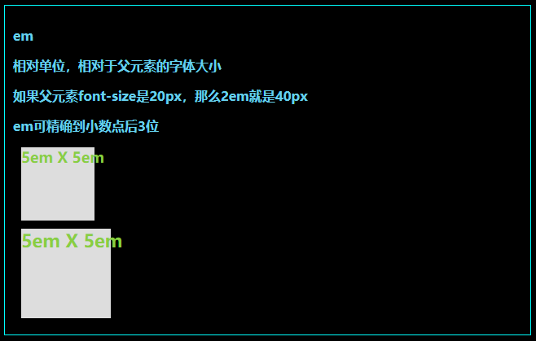
### rem
- 相对单位，相对于html的字体大小
```css
/* list3 */
#length .list3s1 {
  width: 5rem;
  height: 5rem;
}
```
```html
<div class="list3">
  <p>rem</p>
  <p>相对单位，相对于html的字体大小</p>
  <div class="list3s1 s">5rem X 5rem</div>
</div>
```

### ex
- 相对单位，相对于字符的高度，通常为字体高度的一半
- 如果文字高度未设置，则相对于浏览器字体大小高度
```css
/* list4 */
#length .list4s1 {
  width: 10ex;
  height: 1ex;
}

#length .list4s2 {
  width: 10ex;
  height: 2ex;
}

#length .list4fa3 {
  font-size: 20px;
}

#length .list4s3 {
  width: 10ex;
  height: 2ex;
}
```
```html
<div class="list4">
  <p>ex</p>
  <p>相对单位，相对于字符的高度，通常为字体高度的一半</p>
  <p>如果文字高度未设置，则相对于浏览器字体大小高度</p>
  <div class="list4fa1 fa">
    <div class="list4s1 s">10ex X 1ex</div>
  </div>
  <div class="list4fa2 fa">
    <div class="list4s2 s">10ex X 2ex</div>
  </div>
  <div class="list4fa3 fa">
    <div class="list4s3 s">10ex X 2ex</div>
  </div>
</div>
```
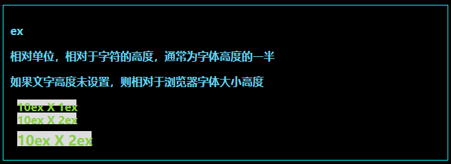
### ch
- 相对单位，数字的宽度
```css
/* list5 */

#length .list5s1 {
  width: 3ch;
}

#length .list5s2 {
  width: 3ch;
}

#length .list5fa2 {
  font-size: 20px;
}

#length .list5s3 {
  width: 3ch;
}
```
```html
<div class="list5">
  <p>ch</p>
  <p>相对单位，数字的宽度</p>
  <div class="list5fa1 fa">
    <div class="list5s1 s">111</div>
    <div class="list5s2 s">111111</div>
  </div>
  <div class="list5fa2 fa">
    <div class="list5s3 s">111</div>
  </div>
</div>
```

### vw/vh
- 相对单位
- 视口横向被分割成100个vw，纵向被分割成100个vh
- 对于PC端来说，视口是浏览器可视区域
- 对于移动端来说，不论横屏还是竖屏，vw始终表示横向宽度，vh始终表示纵向宽度
```css
/* list6 */
#length .list6s1 {
  width: 10vw;
  height: 10vh;
}
```
```html
<div class="list6">
  <p>vw/vh</p>
  <p>相对单位</p>
  <p>视口横向被分割成100个vw，纵向被分割成100个vh</p>
  <p>对于PC端来说，视口是浏览器可视区域</p>
  <p>对于移动端来说，不论横屏还是竖屏，vw始终表示横向宽度，vh始终表示纵向宽度</p>
  <div class="list6s1 s">10vw X 10vh</div>
</div>
```
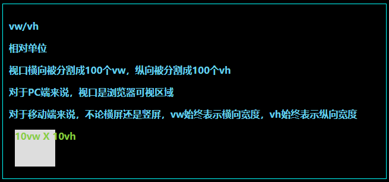
### vmin/vmax
- 相对单位
- 视口的宽度和高度中比较小的为100vmin
- 视口的宽度和高度中比较大的为100vmax
```css
/* list7 */
#length .list7s1 {
  width: 10vmin;
  height: 10vmin;
}

#length .list7s2 {
  width: 10vmax;
  height: 10vmax;
}
```
```html
<div class="list7">
  <p>vmin/vmax</p>
  <p>相对单位</p>
  <p>视口的宽度和高度中比较小的为100vmin</p>
  <p>视口的宽度和高度中比较大的为100vmax</p>
  <div class="list7s1 s">10vmin X 10vmin</div>
  <div class="list7s2 s">10vmax X 10vmax</div>
</div>
```

### cm/mm/q
- 绝对单位，厘米cm，毫米单位mm，1/4毫米q
```css
/* list8 */
#length .list8s1 {
  width: 3cm;
  height: 3cm;
}

#length .list8s2 {
  width: 30mm;
  height: 30mm;
}

#length .list8s3 {
  width: 120q;
  height: 120q;
}
```
```html
<div class="list8">
  <p>cm/mm/q</p>
  <p>绝对单位，厘米cm，毫米单位mm，1/4毫米q</p>
  <div class="list8s1 s">3cm X 3cm</div>
  <div class="list8s2 s">30mm X 30mm</div>
  <div class="list8s3 s">120q X 120q</div>
</div>
```
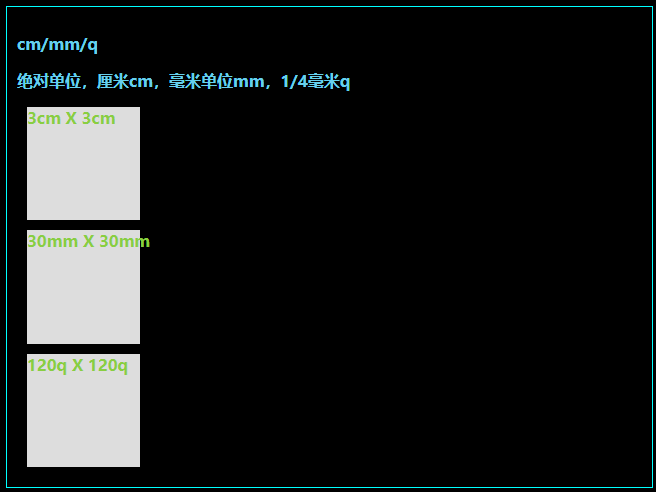
### in
- 绝对单位，英寸in
```css
/* list9 */
#length .list9s1 {
  width: 10in;
  height: 10in;
}
```
```html
<div class="list9">
  <p>in</p>
  <p>绝对单位，英寸in</p>
  <div class="list8s1 s">10in X 10in</div>
</div>
```

### pt/pc
- 绝对单位，点pt，派卡pc
```css
/* list10 */
#length .list10s1 {
  width: 5pt;
  height: 5pt;
}

#length .list10s2 {
  width: 50pt;
  height: 50pt;
}

#length .list10s3 {
  width: 5pc;
  height: 5pc;
}
```
```html
<div class="list10">
  <p>pt/pc</p>
  <p>绝对单位，点pt，派卡pc</p>
  <div class="list10s1 s">5pt X 5pt</div>
  <div class="list10s2 s">50pt X 50pt</div>
  <div class="list10s3 s">5pc X 5pc</div>
</div>
```
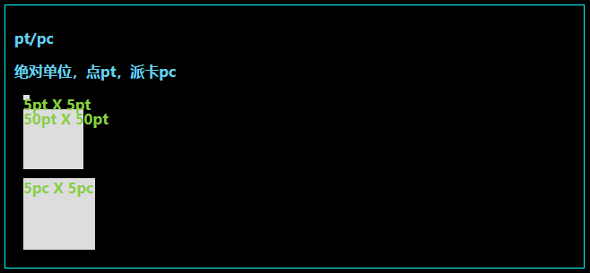
### %
- %
- 相对数值，百分比，相对父元素
```css
/* list11 */
#length .list11f1 {
  width: 100px;
  height: 100px;
}

#length .list11s1 {
  width: 80%;
  height: 70%;
}

#length .list11f2 {
  width: 80px;
  height: 70px;
}

#length .list11s2 {
  width: 80%;
  height: 70%;
}
```
```html
<div class="list11">
  <p>%</p>
  <p>相对数值，百分比，相对父元素</p>
  <div class="list11f1">
    <div class="list11s1 s">80% X 70%</div>
  </div>
  <div class="list11f2">
    <div class="list11s2 s">80% X 70%</div>
  </div>
</div>
```

## 角度
- deg/grad/rad/turn
- 度deg，梯度grad，弧度rad，转turn
- 一个圆360deg，400grad，2πrad，1turn
```css
/* list1 */
#angle .list1s1 {
  width: 80px;
  height: 80px;
  transform: rotate(10deg)
}

#angle .list1s2 {
  width: 80px;
  height: 80px;
  transform: rotate(10grad)
}

#angle .list1s3 {
  width: 80px;
  height: 80px;
  transform: rotate(0.314rad)
}

#angle .list1s4 {
  width: 80px;
  height: 80px;
  transform: rotate(0.2turn)
}
```
```html
<div class="list1">
  <p>deg/grad/rad/turn</p>
  <p>度deg，梯度grad，弧度rad，转turn</p>
  <p>一个圆360deg，400grad，2πrad，1turn</p>
  <div class="list1s1 s">10deg</div>
  <div class="list1s2 s">10grad</div>
  <div class="list1s3 s">0.314rad</div>
  <div class="list1s4 s">0.2turn</div>
</div>
```
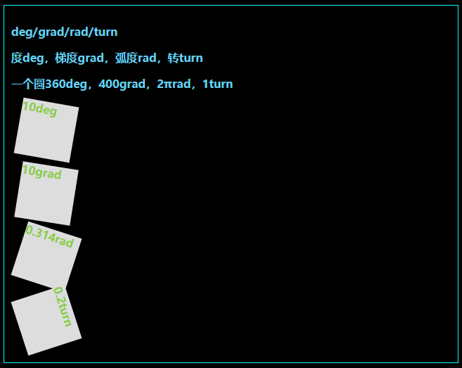
## 时间
- s/ms
- 秒s，毫秒ms
- 用于设定动画执行的时间
## 频率
- Hz/kHz
- 用于设定声音元素频率
## 布局
- fr
- 用于分配一定长度内的剩余空间
```css
/* list1 */
#layout-specific .list1fa1 {
  width: 100px;
  height: 100px;
  display: grid;
  grid-template-columns: 1fr 1fr;
  grid-template-rows: 1fr 1fr;
}

#layout-specific .list1fa1 div {
  border: 5px solid skyblue;
}
```
```html
<div class="list1">
  <p>fr</p>
  <p>用于分配一定长度内的剩余空间</p>
  <div class="list1fa1">
    <div class="list1s1 s"></div>
    <div class="list1s2 s"></div>
    <div class="list1s3 s"></div>
    <div class="list1s4 s"></div>
  </div>
</div>
```
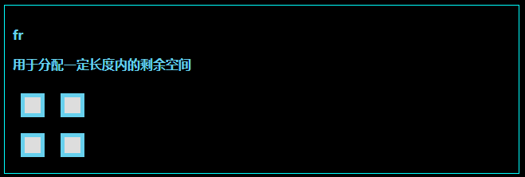

## 分辨率
- dpi/dpcm/dppx
- 每英寸包含点的数量dpi
- 每厘米包含点的数量dpcm
- 每像素包含点的数量dppx
## 颜色
### color name
- 使用颜色关键字指定颜色
```css
/* list1 */
#color .list1s1 {
  width: 100px;
  height: 100px;
  background-color: darkseagreen;
}
#color .list1s2 {
  width: 100px;
  height: 100px;
  background-color: salmon;
}
```
```html
<div class="list1">
  <p>color name</p>
  <p>使用颜色关键字指定颜色</p>
  <div class="list1s1 s">darkseagreen</div>
  <div class="list1s2 s">salmon</div>
</div>
```
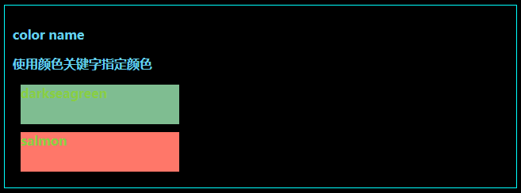
### HEX
- 使用十六进制整数指定颜色
```css
/* list2 */
#color .list2s1 {
  width: 100px;
  height: 100px;
  background-color: #f1d2b3;
}
#color .list2s2 {
  width: 100px;
  height: 100px;
  background-color: #a3c2e1;
}
```
```html
<div class="list2">
  <p>HEX</p>
  <p>使用十六进制整数指定颜色</p>
  <div class="list2s1 s">#f1d2b3</div>
  <div class="list2s2 s">#a3c2e1</div>
</div>
```
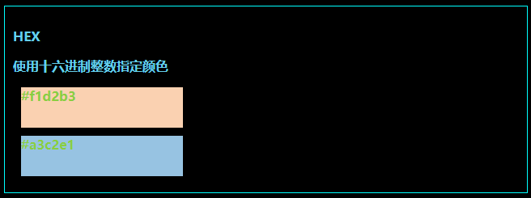
### RGB
- R:red;G:green;B:blue;
- 颜色的比例指定颜色
- 值在0到255之间
```css
/* list3 */
#color .list3s1 {
  width: 100px;
  height: 100px;
  background-color: rgb(111,222,123);
}
#color .list3s2 {
  width: 100px;
  height: 100px;
  background-color: rgb(0,1,2);
}
```
```html
<div class="list3">
  <p>RGB</p>
  <p>R:red;G:green;B:blue;</p>
  <p>颜色的比例指定颜色</p>
  <p>值在0到255之间</p>
  <div class="list3s1 s">rgb(111,222,123)</div>
  <div class="list3s2 s">rgb(0,1,2)</div>
</div>
```

### RGBA
- R:red;G:green;B:blue;A:alpha;
- 颜色的比例指定颜色,alpna指定透明度
- 值在0到255之间，alpha的值在0到1之间，0.2可以用.2表示
```css
/* list4 */
#color .list4s1 {
  width: 100px;
  height: 100px;
  background-color: rgba(111,222,123,0.2);
}
#color .list4s2 {
  width: 100px;
  height: 100px;
  background-color: rgba(111,222,123,.2);
}
```
```html
<div class="list4">
  <p>RGBA</p>
  <p>R:red;G:green;B:blue;A:alpha;</p>
  <p>颜色的比例指定颜色,alpna指定透明度</p>
  <p>值在0到255之间，alpha的值在0到1之间，0.2可以用.2表示</p>
  <div class="list4s1 s">rgba(111,222,123,0.2)</div>
  <div class="list4s2 s">rgba(111,222,123,.2)</div>
</div>
```
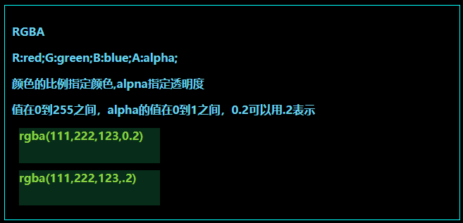
### HSL
- H:hue色调，0或者360表示红色，120表示绿色，240表示蓝色
- S:saturation饱和度，取值在0.0%到100.0%之间
- L:lightness亮度，取值在0.0%到100.0%之间
```css
/* list5 */
#color .list5s1 {
  width: 100px;
  height: 100px;
  background-color: hsl(280, 50%, 60%);
}
#color .list5s2 {
  width: 100px;
  height: 100px;
  background-color: hsl(50, 50%, 60%);
}
```
```html
<div class="list5">
  <p>HSL</p>
  <p>H:hue色调，0或者360表示红色，120表示绿色，240表示蓝色</p>
  <p>S:saturation饱和度，取值在0.0%到100.0%之间</p>
  <p>L:lightness亮度，取值在0.0%到100.0%之间</p>
  <div class="list5s1 s">hsl(280, 50%, 60%)</div>
  <div class="list5s2 s">hsl(50, 50%, 60%)</div>
</div>
```
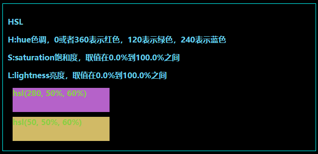
### HSLA
- H:hue色调，0或者360表示红色，120表示绿色，240表示蓝色
- S:saturation饱和度，取值在0.0%到100.0%之间
- L:lightness亮度，取值在0.0%到100.0%之间
- A:alpha透明度
```css
/* list6 */
#color .list6s1 {
  width: 100px;
  height: 100px;
  background-color: hsla(280, 50%, 60%,0.6);
}
#color .list6s2 {
  width: 100px;
  height: 100px;
  background-color: hsla(50, 50%, 60%,.6);
}
```
```html
<div class="list6">
  <p>HSLA</p>
  <p>H:hue色调，0或者360表示红色，120表示绿色，240表示蓝色</p>
  <p>S:saturation饱和度，取值在0.0%到100.0%之间</p>
  <p>L:lightness亮度，取值在0.0%到100.0%之间</p>
  <p>A:alpha透明度</p>
  <div class="list6s1 s">hsla(280, 50%, 60%,0.6)</div>
  <div class="list6s2 s">hsla(50, 50%, 60%,.6)</div>
</div>
```

### transparent
- 全黑透明色，即rgba(0,0,0,0)
```css
/* list7 */
#color .list7s1 {
  width: 100px;
  height: 100px;
  background-color: transparent;
}
```
```html
<div class="list7">
  <p>transparent</p>
  <p>全黑透明色，即rgba(0,0,0,0)</p>
  <div class="list7s1 s">transparent</div>
</div>
```

### currentColor
- color具有继承性，currentColor相当于继承color颜色
```css
/* list8 */
#color .list8s1 {
  width: 100px;
  height: 100px;
  background-color: currentColor;
}
```
```html
<div class="list8">
  <p>currentColor</p>
  <p>color具有继承性，currentColor相当于继承color颜色</p>
  <div class="list8s1 s">currentColor</div>
</div>
```

## 函数
- calc()
- calc(四则运算)
- 用于动态计算长度值，运算符前后要加空格
```css
/* list1 */
#function .list1s1 {
  width: calc(50% - 20rem);
  height: calc(20em - 200px);
}

#function .list1s2 {
  width: calc(20rem - 150px);
  height: calc(200px - 6em);
}
```
```html
<div class="list1">
  <p>calc()</p>
  <p>calc(四则运算)</p>
  <p>用于动态计算长度值，运算符前后要加空格</p>
  <div class="list1s1 s">calc(50% - 20rem) X calc(20em - 200px)</div>
  <div class="list1s2 s">calc(20rem - 150px) X calc(200px - 6em)</div>
</div>
```
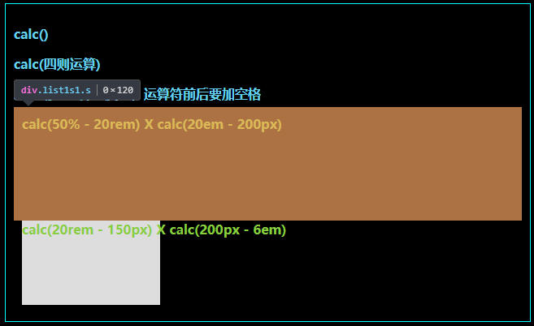
## 生成内容
- attr()
- 用于content属性，取当前元素的属性值
- 可以拼接字符串
```css
/* list1 */
#content .list1s1 {
  width: 100px;
  height: 100px;
}
#content .list1s1:before {
  content: "("attr(datamsgb)")";
  font-size: 12px;
}
#content .list1s1:after {
  content: attr(datamsga);
  font-size: 14px;
}
```
```html
<div class="list1">
  <p>attr()</p>
  <p>用于content属性，取当前元素的属性值</p>
  <p>可以拼接字符串</p>
  <div class="list1s1 s" datamsgb="before" datamsga="after">实际元素</div>
</div>
```
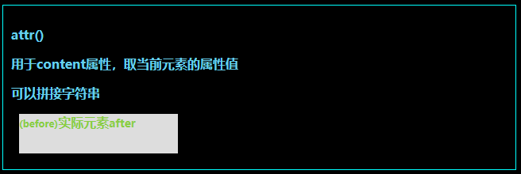
